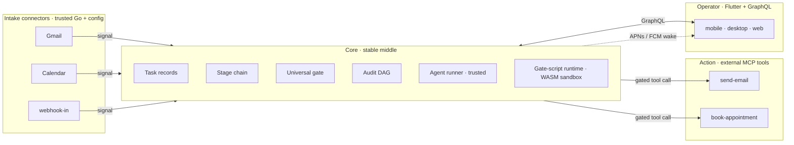
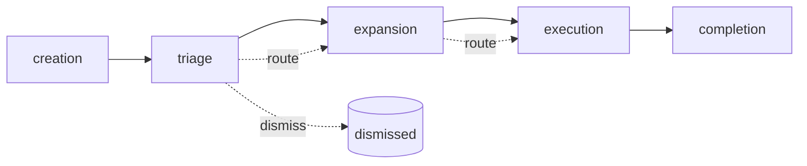
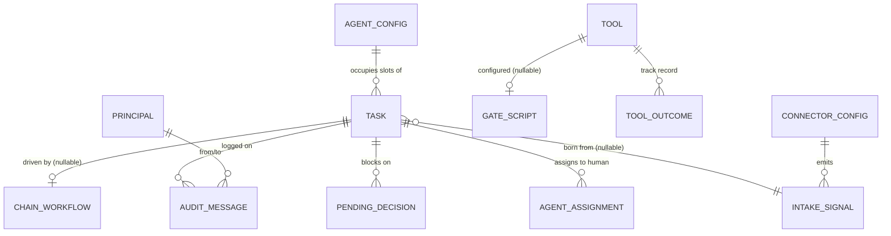
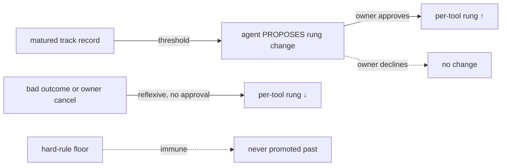
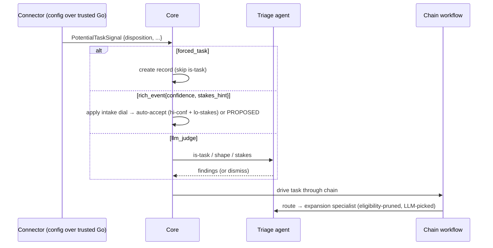
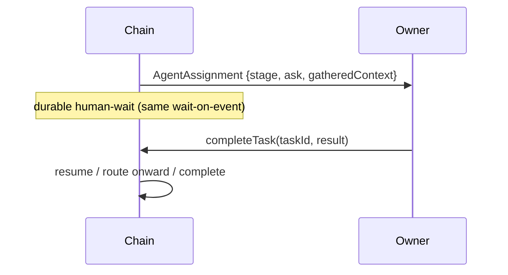

# Tendant — Master Architecture Specification (v2)

| | |
|---|---|
| **Status** | Consolidated spec, v2. Supersedes v1. Folds in the stage-chain execution model, agents/connectors as trusted-Go-plus-config, the human as a catalog entry, emergent autonomy, the self-hosted security posture, and the fully-specified intake edge. |
| **Date** | 2026-05-25 |
| **Scope** | The whole system: core, the stage chain, the four extension surfaces, the trust spine, the durable substrate, the data model, the wire contracts, and the implementation skeletons. |
| **Deployment** | **Self-hosted, single-household.** One instance per household; one owner. Federation connects instances; it is not multi-tenancy. |
| **Engine** | DBOS (durable execution) over Postgres. The operator edge is engine-agnostic (§13). |
| **Reference lineage** | `BCNelson/pulse` — Go (`gqlgen`, `chi`, `pgx`) + Flutter (`ferry`, `riverpod`, `drift`, `go_router`), Postgres-only, `LISTEN/NOTIFY`→broadcaster→subscription + APNs/FCM push. Operator-edge conventions lifted from it. |

---

## Changelog from v1

The design review materially evolved the model. The substantive changes v2 carries:

1. **Execution is a fixed stage chain** — `creation → triage → expansion → execution → completion`. Each stage is an agent. The vague "executor" of v1 is gone. Stages are *verbs* (transitions); lifecycle states are the resting *nouns* between them (§3, §4).
2. **Agents are config, not code** — a specialist is `{system prompt, model, tool allowlist, eligibility, stage}` over one trusted, in-process Go agent runner (§8). The catalog ships base specialists; community contributes/shares *configs*, not executables.
3. **Routing is LLM-proposes, rules-bound** — configs declare hard eligibility; the LLM router picks among the eligible (§8.4).
4. **Findings are structured + free text** — machine-checkable fields bind hard eligibility; free text feeds the router's choice (§8.5).
5. **The human is a catalog entry** — selectable into any slot. Story 1 ("the task I do myself"), gate escalation, sub-agent escalation, and mid-flight hand-off all collapse into "an agent chose the human for the next slot" (§8.6).
6. **The operator surface gains *assignments*** — two families now: *decisions* (a verdict) and *assignments* (work to do). New `AgentAssignment` type + the missing `completeTask` mutation (§11.3).
7. **Per-task autonomy is emergent, not stored** — dropped as an authoritative field; it's a readout from the routed specialist's toolset + each tool's rules. Per-*tool* autonomy stays (it's what the ratchet promotes) (§3.3, §7.4).
8. **Clean/bad outcome = inferred-clean + retroactive owner flag**, with a maturation window before an inferred-clean outcome is promotion-eligible (§7.5).
9. **Self-hosted, single-household, tightest-posture-first** — gate scripts are the one untrusted-code surface; everything loosens later via versioned capabilities (§2.3, §13).
10. **The intake edge is fully specified** — trusted connectors + config, per-emission disposition (`forced_task | rich_event{confidence, stakes_hint} | llm_judge`), Stage 2 collapsed into triage (§9).

---

## Table of contents

1. [First principles](#1-first-principles)
2. [System architecture & the four extension surfaces](#2-system-architecture--the-four-extension-surfaces)
3. [The stage chain — the execution model](#3-the-stage-chain--the-execution-model)
4. [Domain model & the two axes](#4-domain-model--the-two-axes)
5. [Data model (Postgres)](#5-data-model-postgres)
6. [Core: orchestration & the one durable primitive](#6-core-orchestration--the-one-durable-primitive)
7. [The trust spine: gate, autonomy, calibration](#7-the-trust-spine-gate-autonomy-calibration)
8. [The agent layer: specialists as config](#8-the-agent-layer-specialists-as-config)
9. [Intake edge (in): connectors & dispositions](#9-intake-edge-in-connectors--dispositions)
10. [Action edge (out): tools & gate scripts](#10-action-edge-out-tools--gate-scripts)
11. [Operator edge (human): GraphQL, decisions & assignments](#11-operator-edge-human-graphql-decisions--assignments)
12. [CC-1: sub-agent protocol & federation](#12-cc-1-sub-agent-protocol--federation)
13. [Deployment, stack & the engine seam](#13-deployment-stack--the-engine-seam)
14. [Sequence flows](#14-sequence-flows)
15. [Resolved questions & open questions](#15-resolved-questions--open-questions)
16. [Deferred / future](#16-deferred--future)
17. [Appendix A — Postgres DDL](#appendix-a--postgres-ddl)
18. [Appendix B — GraphQL SDL](#appendix-b--graphql-sdl)
19. [Appendix C — gate-script ABI & examples](#appendix-c--gate-script-abi--examples)
20. [Appendix D — core Go interfaces](#appendix-d--core-go-interfaces)

---

## 1. First principles

Five invariants govern everything. Every later section is a consequence of one of them.

**P1 — Autonomy is emergent, never stored.** There is no "human task" vs "agent task," and there is no authoritative per-task autonomy dial. *How autonomous a task is* falls out of two things: which specialist (possibly the human) the router placed in each stage slot, and what each tool's per-tool rules permit. Add a tool or promote a tool's rung, and existing tasks become more automatable with zero migration.

**P2 — A task is not a workflow.** A *task* is a durable Postgres record. The *chain workflow* is the durable DBOS execution that walks a task through the stages, attached to the record, not fused with it. A task outlives any workflow — which is what makes hand-off and federation work.

**P3 — Capability grows at the edges; the core never grows to accommodate a source, an action, an agent, or a client.** Four extension surfaces (§2.2); one stable middle.

**P4 — Trust is earned upward, lost reflexively, and the floor is immune.** Per-tool promotion is owner-gated; demotion is automatic on a bad outcome; no track record buys a tool past the categorical hard-rule floor (§7.4).

**P5 — One universal gate governs every tool call, from every agent, at every stage.** There is no privileged code path that skips the gate. This is what makes a config-driven, eventually-community-contributed agent layer safe: whatever an agent is told to do, every tool call it emits is independently gated by rules the agent cannot touch (§7).

Plus one deployment stance: **tightest-posture-first.** Ship the most locked-down version of every surface; loosen later via versioned capability additions when a real feature demands it. The ratchet only turns toward *more* permissive, never back.

---

## 2. System architecture & the four extension surfaces

### 2.1 Containers

| Container | Tech | Responsibility |
|---|---|---|
| **Core API** | Go (`gqlgen`, `chi`, `pgx`) | Task records, the stage chain, the universal gate, the audit DAG, intake dispatch, action dispatch, GraphQL at `/graphql` |
| **Agent runner** | Go, in-process | One trusted plan→act→observe loop; specialists are *configs* over it (§8) |
| **Durable engine** | DBOS over Postgres | Chain workflows, connector pipelines, the wait-on-event primitive, crash recovery |
| **Gate-script runtime** | wazero (pure-Go) + Extism, in-process | Sandboxed WASM evaluation of untrusted per-tool gate scripts (§10.3) |
| **Connector layer** | Go, in-process | Trusted source connectors (Gmail, Calendar, IMAP, webhook-in, RSS…); integrations are configs over them (§9) |
| **Realtime / wake** | Postgres `LISTEN/NOTIFY` + APNs/FCM worker | Foreground subscriptions + background push (§11.5) |
| **Operator client** | Flutter (`ferry`, `riverpod`, `drift`, `go_router`) | One codebase: mobile, desktop, web |
| **Datastore** | Postgres only | Records, audit DAG, DBOS state, credentials, `LISTEN/NOTIFY`; no broker |

### 2.2 The four extension surfaces

P3 says capability grows only at the edges. There are four, and they sort cleanly by *how they're contributed* and *how they're trusted*:

| Surface | What it is | Trust model | Contract |
|---|---|---|---|
| **Intake connectors** (in) | trusted Go connector + a **config** (credentials, coarse filter, schedule, disposition rules) | trusted code; config is data | normalized potential-task signal (versioned) |
| **Agents** | trusted Go runner + a **config** (system prompt, model, tool allowlist, eligibility, stage) | trusted code; config is data | agent-config schema + the universal gate (versioned) |
| **Gate scripts** (action) | **untrusted WASM** evaluator per tool | the one genuinely-untrusted surface — sandboxed, no egress, statically validated | gate-script ABI + capability manifest (versioned) |
| **Tools** (action, out) | external **MCP** servers | owner-connected, behind the tool boundary; every call gated | MCP tool contract + per-tool advanced rule set (versioned) |
| **Operator** (human) | Flutter client over GraphQL | owner-facing; not pluggable in the same sense | GraphQL schema + wake channels (versioned) |

The symmetry worth internalizing: **connectors and agents are the same pattern** — trusted Go code steered by config — so neither needs a sandbox; containment comes from the config's allowlist plus the universal gate. **Gate scripts are the exception**: genuinely untrusted code, hence the WASM sandbox. **Tools** live outside the boundary entirely (MCP), gated on every call.



### 2.3 The security posture (self-hosted, tightest-first)

One instance per household means **no tenant-isolation problem exists** — the hardest class of attack is eliminated by construction, and the owner's data never leaves their boundary except through inference (which is itself a gated/configured egress). The locks ship tight and ratchet open:

- **Gate scripts:** no egress, deny-by-default capability manifest, static import validation. Loosen via a future `external_fetch` manifest capability.
- **Agents:** inference routes through the platform model gateway, not an agent's own egress; community agents (config bundles that could name a model endpoint) get *surface-and-confirm on install*. BYO-model stays behind an explicit, owner-consented capability.
- **Community connectors / agents:** deferred for v1; core ships the base set. The *contracts* are designed now so the locked versions slot in unchanged later.

---

## 3. The stage chain — the execution model

### 3.1 The chain

Every task walks a fixed-shape chain. Each stage is an **agent** (a config over the runner). The *occupants* of the expansion and execution slots are chosen per task by the router; the *shape* never changes.



| Stage | What the stage-agent does | Reads / writes |
|---|---|---|
| **creation** | The record comes into being (intake signal, or owner-authored). | writes the `Task` |
| **triage** | Confirms is-task (unless `forced_task`), shapes the task, scores stakes, emits **findings**, and **routes** to an expansion specialist. (This *is* the old "Stage 2 intake gate.") | writes `findings`, sets routing |
| **expansion** | A *specialized* agent enriches (read-only lookups → `context_refs`), decomposes, gathers what execution needs, emits findings, and **routes** to an execution specialist. | writes `context_refs`, `findings` |
| **execution** | A *specialized* agent performs the outward work via gated tool calls. | gated tool calls; audit |
| **completion** | Closes the task, summarizes, records the outcome (→ calibration). | writes outcome, audit |

### 3.2 Stages are verbs; states are nouns

The chain *stages* are what the durable workflow is *doing*. The task's **lifecycle state** is its durable resting point. They are different axes, and both are needed — the state powers the operator UI and durable checkpoints; the stage tracks active processing.

| Lifecycle state | Reached when | Active stage around it |
|---|---|---|
| `PROPOSED` | intake signal needs sign-off | (awaiting acceptance) |
| `ACCEPTED` | owner accepts, or auto-accept fires | post-triage |
| `ELIGIBLE` | readiness conditions met *(open Q, §15)* | pre-expansion |
| `EXECUTING` | an execution specialist (or the human) holds the slot | execution |
| `DONE` | completion finishes | — |
| `DISMISSED` | triage or owner rejects | — |
| `HALTED` | owner cancels — forward progress stops, **nothing rolls back** | any |

### 3.3 Autonomy is the emergent readout

There is **no stored task autonomy dial.** The familiar ladder is a *description of emergent outcomes*, produced by who occupies the execution slot and what the per-tool rules allow:

> `none` (privacy; chain barely processes it) → `enrich-only` (expansion runs, execution slot = human) → `propose` (execution agent drafts, every outward call gates to you) → `execute-gated` (calls gated per per-tool rules) → `execute-auto` (low-risk calls auto-approved; **floor still gates**)

The only *stored* autonomy is **per-tool** (the rung the ratchet promotes, §7.4). Task-level autonomy is computed on read.

---

## 4. Domain model & the two axes

### 4.1 Entities

| Entity | Essence |
|---|---|
| **Task** | The durable unit. Carries state, current stage, provenance, `context_refs`, `findings`. Outlives any workflow (P2). |
| **Chain workflow** | The DBOS execution walking a task through the stages. Nullable on the record. |
| **Agent config** | A catalog entry: `{stage, system_prompt, model, tool_allowlist, eligibility}`. The unit of the agent layer (§8). The **human** is a special catalog entry. |
| **Connector config** | A catalog entry binding a trusted connector to credentials + filter + schedule + disposition rules (§9). |
| **Tool** | An external MCP capability + its per-tool advanced rule set (permissions + gate script + overseer instructions). |
| **Findings** | `{structured fields, free text}` emitted by triage/expansion. Structured fields bind hard eligibility; free text feeds router choice (§8.5). |
| **PendingDecision** | A verdict owed by the owner: approval, agent-question, promotion proposal. |
| **AgentAssignment** | *Work* handed to the human by an agent or the router: a slot the human was routed into, with gathered context + a specific ask (§11.3). |
| **AuditMessage** | A node in the message-shaped audit DAG. The trust backbone. |
| **Principal** | An actor (`User | Bot`), federation-shaped via `globalUri`. |

### 4.2 The "things that need me" surface has two families

- **Decisions** — the owner renders a *verdict* (approve an artifact, authorize a mandate, answer an agent, accept/dismiss, respond to a promotion).
- **Assignments** — the owner does *work* (the human was routed into a stage slot). Bare owner-authored tasks are plain list items; *agent-originated* hand-offs become `AgentAssignment`s carrying the context prior stages assembled plus the specific ask.

Both surface in one inbox (§11.3). `completeTask` resolves an assignment (and closes a self-made task).

---

## 5. Data model (Postgres)

Spine here; full DDL in **Appendix A**. Postgres is the only datastore (records, audit DAG, DBOS state, encrypted credentials, `LISTEN/NOTIFY`).



Notable v2 schema changes from v1:

- **`tasks`** drops the authoritative `autonomy` column (emergent now). Adds `current_stage`, `findings` (jsonb), keeps `context_refs`, `provenance`, `global_uri`.
- **`agent_configs`** (new) — the specialist catalog: `stage`, `system_prompt`, `model`, `tool_allowlist` (jsonb), `eligibility` (jsonb hard constraints), `origin` (`core|community`), `version`, `is_human` (the human catalog entry).
- **`connector_configs`** (new) — `connector_type`, `credentials_ref`, `filter` (jsonb), `schedule`, `disposition_rules` (jsonb), `enabled`.
- **`source_credentials`** (new) — encrypted OAuth tokens, connector-managed refresh.
- **`intake_signals`** — adds `disposition` (`forced_task|rich_event|llm_judge`), `confidence`, `stakes_hint`; keeps unique `idempotency_key`, `provenance`, `signal_version`.
- **`agent_assignments`** (new) — `task_id`, `stage`, `from_principal` (nullable; null = self-authored), `ask`, `gathered_context` (jsonb), `resolved_at`.
- **`tools` / `gate_scripts` / `pending_decisions` / `audit_messages` / `tool_outcomes` / `device_tokens`** carry over from v1 (audit DAG via `in_reply_to` self-FK; `tool_outcomes` adds a `matured_at` to support the promotion maturation window, §7.5).

---

## 6. Core: orchestration & the one durable primitive

### 6.1 The unifying observation (unchanged, now load-bearing in more places)

There is exactly **one** durable wait, reused everywhere:

> **wait-on-event** backs: awaiting your approval, awaiting a tool's result, answering a sub-agent's question, **and the chain pausing for a human to fill a stage slot** (the assignment case). No new machinery for any long-running interaction.

### 6.2 The chain workflow

A DBOS **chain workflow** drives a task through the stages. At each stage it invokes the selected agent config via the runner, applies the universal gate to every tool call, persists the resulting state/findings as a durable checkpoint, then routes onward. When the router places the **human** in the next slot, the workflow does a durable human-wait and surfaces an `AgentAssignment` or `PendingDecision`; the human's `completeTask`/decision mutation resolves the wait and the chain continues (or completes).

```go
// Illustrative DBOS-style chain workflow.
func chainWorkflow(ctx dbos.Context, taskID uuid.UUID) error {
    t := load(ctx, taskID)
    for stage := t.CurrentStage; stage != StageDone; {
        agent := router.Select(ctx, stage, t.Findings)   // LLM-proposes, rules-bound (§8.4)
        if agent.IsHuman {
            // route the slot to the human: durable wait, then resume
            res := dbos.WaitForEvent(ctx, assignmentKey(taskID, stage))
            t = applyHumanResult(ctx, t, stage, res)
        } else {
            out := runner.Run(ctx, agent, t)              // every tool call → universal gate
            t = persistCheckpoint(ctx, t, stage, out)     // findings/context_refs/state
        }
        stage = nextStage(stage, t)
    }
    return complete(ctx, t)                               // records outcome → calibration
}
```

Cancel (§3.2) is `dbos.Cancel(workflowID)` + mark `HALTED`. **No rollback**; the floor (§7.3) is what makes that safe — the scary things were gated *before* they happened.

---

## 7. The trust spine: gate, autonomy, calibration

### 7.1 The universal gate

Every tool call, from every stage-agent, passes the same gate. Read-only calls (most triage/expansion lookups) short-circuit as ungraded/auto; graded-class calls (most execution) run the full stack.

```mermaid
flowchart TD
  CALL[Any agent's tool call] --> RO{Read-only / ungraded?}
  RO -->|yes| AUTO[Auto · short-circuit]
  RO -->|no| FLOOR[Hard-rule floor · sets MIN gate level]
  FLOOR --> SCRIPT{Gate script configured?}
  SCRIPT -->|no| OVS[Overseer · LLM grader]
  SCRIPT -->|yes| RUN[Run WASM script → verdict]
  RUN --> V{Verdict}
  V -->|Approve| FC{Trips floor?}
  FC -->|no| OK[Permit as-composed]
  FC -->|yes| RD
  V -->|Deny| NO[Block]
  V -->|RequestDecision| RD[Durable human-wait · Artifact \| Mandate]
  V -->|AgentHandoff| OVS
  OVS --> OUT[Approve / gate to human]
```

### 7.2 The per-tool advanced rule set

> advanced rule set = **permissions** (declarative; feeds the floor) + **gate script** (untrusted WASM; §10.3) + **overseer instructions** (owner-authored; feeds the grader)

The **overseer** is one LLM grader, parameterized per tool by **owner-authored** instructions. Hard invariant: instructions come from the owner, never from any executor agent; owner instructions and any script-supplied evidence sit in **separate, labeled slots** in the prompt, so neither a stage-agent's system prompt nor a community gate script can soften the judge. This is why customizable agent system prompts are safe (§8.3).

### 7.3 The hard-rule floor (categorical, immune)

Evaluated first; sets a minimum gate level nothing downstream can lower. Contents:

1. **Spend.**
2. **Irreversible third-party effect** (a message to a stranger; an external effect with no recall).
3. **Secret disclosure** (the CC-1 inbound mirror: a class of secrets never disclosed to an outbound-contact sub-agent without explicit per-call approval).

Fed per-tool by the `permissions` half, but categorical beneath all per-tool tuning. This is what makes cancel-only (§6.2) and untrusted gate scripts safe.

### 7.4 The earned-autonomy ratchet (per-tool, asymmetric)



- **Promotion is owner-gated**; the agent never self-escalates.
- **Demotion is reflexive** — automatic, no mutation, no approval.
- **The floor is immune.**
- **v1 promotes discrete rungs only;** auto-rewriting overseer instructions is deferred.

### 7.5 Clean/bad determination & the maturation window

Outcomes feed the ratchet, and the signal is **inferred-clean by default, with a retroactive owner veto**:

- An outcome that reaches `DONE` with no cancel and no complaint is recorded **clean** by default.
- The owner can **retroactively flag** any completed action bad; a flag both records the outcome *and reflexively demotes* the tool.
- Because trust accrues silently, an inferred-clean outcome is **not promotion-eligible until it matures** (a settling window, `matured_at`), so the owner's retroactive veto has time to land before that outcome can buy a rung. Promotions count only matured-clean outcomes.

### 7.6 Calibration — one loop, both edges

Execution calibration (matured outcomes → per-tool rungs) and intake tuning (dismissals → what gets proposed) are the **same loop**, reading the audit DAG on the two edges. One subsystem.

---

## 8. The agent layer: specialists as config

### 8.1 The runner and the catalog

There is **one trusted, in-process Go agent runner** (a plan→act→observe loop). A "specialist" is not code — it's a **config** over that runner:

```
AgentConfig = {
  stage:          triage | expansion | execution   (or the human slot)
  system_prompt:  string
  model:          model ref (routed through the platform gateway)
  tool_allowlist: [tool refs]      // the runner exposes ONLY these to the model
  eligibility:    hard constraints // bind to findings' structured fields (§8.5)
  origin:         core | community
}
```

The **catalog** is the set of configs. Core ships base specialists; community contributes/shares configs (deferred for v1; the contract is fixed now). Adding a specialist is data, not a deploy.

### 8.2 Containment

A config-driven agent is contained by exactly two things, no sandbox required:

1. **The per-agent tool allowlist** — the runner exposes only the configured tools to the model, so an agent *cannot* reach a tool outside its set.
2. **The universal gate (P5)** — whatever it does call is independently gated.

### 8.3 Why customizable prompts are safe

Owners (and shared configs) customize system prompts, models, and tool sets. None of that can weaken control: the overseer reads the **concrete call**, never the agent's framing (§7.2); the floor is categorical; and the allowlist bounds reachable tools. A hostile prompt can make an agent *try* things — every attempt is still gated by rules the prompt cannot touch.

### 8.4 Routing — LLM-proposes, rules-bound

At triage and again after expansion, the router selects the next stage's occupant:

1. **Hard eligibility prunes** — each config's `eligibility` constraints are matched (deterministically) against the findings' **structured fields**. Only eligible configs survive.
2. **The LLM router picks** among the survivors, reading the findings' **free text**. Non-determinism is fenced inside a vetted candidate set.

The **human** is always an eligible candidate for any slot, so "route to the human" is the same mechanism as routing to any specialist.

### 8.5 Findings

```
Findings = {
  structured: {                 // machine-checkable; hard eligibility binds here
    category_hints: [string],
    stakes_score:   number,
    entities:       [..],
    required_capabilities: [string]
  },
  free_text: string             // narrative; the LLM router reads this to choose
}
```

Findings land in the task's `findings` column; enrichment output lands in `context_refs`.

### 8.6 The human as a catalog entry

The human is a catalog entry selectable into any slot. This collapses several v1 concepts into one mechanism:

- **"The task I do myself"** = the router put the human in the execution slot.
- **Gate `RequestDecision`, a sub-agent escalating, a specialist handing off because it's stuck** = an agent chose the human for the next slot, over the one wait-on-event.
- **Mid-flight hand-off** = re-routing a slot between the human and a specialist, either direction.

"Human vs agent" is never a stored type — only which catalog entry holds a slot.

---

## 9. Intake edge (in): connectors & dispositions

### 9.1 Connectors are trusted Go + config

The core ships trusted connectors (Gmail, Calendar, IMAP, webhook-in, RSS, …). An **integration** is a `connector_config` binding a connector to credentials, a coarse filter, a schedule, and disposition rules. Community contributes a connector in-tree (trusted, reviewed) or just shares a config. No untrusted code on this edge.

### 9.2 The disposition model — the privacy/cost firewall

Triage is an LLM stage, and inference may go to an external model — so "judge every raw item" means *shipping your whole inbox out and paying per item.* The connector therefore chooses, **per emission**, how to surface, putting the firewall where the most context lives:

| Disposition | Meaning | Cost / privacy |
|---|---|---|
| `forced_task` | "This *is* a task." Creates the record directly; skips the is-task judgment. | no model |
| `rich_event{confidence, stakes_hint}` | A structured candidate with self-assessed is-task confidence **and** a coarse stakes hint. The core applies the intake-autonomy dial. | no model |
| `llm_judge` | "I can't decide." Hands the raw payload to triage's LLM for is-task / shape / stakes. | LLM — opt-in, ambiguity only |

The intake-autonomy dial keys on **both** confidence and stakes: high-confidence **and** low-stakes `rich_event`s **auto-accept** as dismissible enrich-only tasks (they arrive already-enriched via expansion); anything ambiguous on either axis the connector routes to `llm_judge`, or the dial holds it `PROPOSED` for sign-off.

### 9.3 Stage 2 *is* triage

There is no separate "intake gate" component. A connector emits a signal → it becomes a `PROPOSED` (or auto-accepted) record (**creation**) → the **triage** stage does is-task / shape / stakes / routing. The two-stage intake of v1 collapses into "one connector + the existing chain."

### 9.4 The signal contract (versioned)

```go
type PotentialTaskSignal struct {
    SignalVersion  string
    SourceID       string
    IdempotencyKey string                  // kills self-duplication
    Provenance     Provenance              // raw ref + why flagged
    Payload        json.RawMessage
    Disposition    string                  // forced_task | rich_event | llm_judge
    Confidence     *float64                // set for rich_event
    StakesHint     *float64                // set for rich_event
}
```

### 9.5 Self-hosted intake defaults

- **Auth:** OAuth tokens stored **encrypted in Postgres**; the connector handles refresh. The owner does the OAuth dance once per source.
- **Poll vs push:** a box behind NAT can't receive webhooks, so **polling is the default trigger** (a DBOS scheduled workflow per enabled connector). Webhook connectors are viable only where the household box has real ingress; otherwise a relay is future work.
- **Privacy / source scoping:** the `none` rung extends to *sources* — a source the owner marks untouched is never read. (Deferred refinement, §16.)

---

## 10. Action edge (out): tools & gate scripts

### 10.1 Tools are external MCP

Tendant composes intent, gates it, dispatches to MCP tools, records outcomes. Anything real-time/interactive (a live call) lives behind the tool boundary and is out of core scope. Capability growth = tool growth. Voice is "whenever a voice tool exists."

### 10.2 The tool contract (versioned)

A tool declares its **advanced rule set** in one place: permissions + gate script + overseer instructions (§7.2). Reversibility/compensation metadata is deferred (addable as a contract bump; tools default to "irreversible").

### 10.3 Gate scripts (the one untrusted-code surface)

A **bounded, read-only, run-to-completion** WASM classifier attached to a tool, run for graded-class calls. It triages deterministic cases and escalates the rest with gathered evidence. **Terminal verdicts only:**

```
Verdict = Approve | Deny | RequestDecision{context} | AgentHandoff{context}
```

- `Approve` is **advisory and floor-subordinate** (a floor-tripping call is downgraded to `RequestDecision`).
- `RequestDecision.context` is the polymorphic `Artifact | Mandate` payload (§11.2).
- `AgentHandoff.context` is **evidence the overseer weighs, never instructions it obeys** — script authors are a principal the executor/overseer separation didn't originally contemplate.

**Durability lives in the gate, not the script.** Scripts run non-durably inside the durable gate workflow; reads aren't memoized; a crashed run commits no verdict and re-runs fresh; only a completed run's verdict + evidence is audited.

**Data model:** internal reads only (host functions over the owner's own data); **no egress** in v1 (removes the whole exfiltration-policy class — there's nowhere to exfiltrate *to*). External signal, when wanted, is fetched by the trusted enrichment plane and read by the script as internal data.

**Capability manifest:** declares which internal data domains the script reads; **statically enforced** by inspecting the WASM import section before instantiation (a module importing an ungranted host function is rejected un-run). Versioned; `external_fetch` reserved for the future.

**Runtime:** Go host, **wazero** (pure-Go, no CGo) + **Extism**; AssemblyScript Tier-1 (in-app compile via `asc`; server-side compile from source is the artifact of record), Rust Tier-2 (BYO `.wasm`). Bounded by execution timeout + memory cap (no instruction fuel — would need CGo). ABI + examples in **Appendix C**.

---

## 11. Operator edge (human): GraphQL, decisions & assignments

> "Things that need me find me" is a *delivery* claim. This edge carries the owner's **reads** and two families of action: **decisions** (verdicts) and **assignments** (work). Full SDL in **Appendix B**.

### 11.1 Task / lifecycle / stage / emergent autonomy

```graphql
enum TaskState   { PROPOSED ACCEPTED ELIGIBLE EXECUTING DONE DISMISSED HALTED }
enum ChainStage  { CREATION TRIAGE EXPANSION EXECUTION COMPLETION }
enum AutonomyLevel { NONE ENRICH_ONLY PROPOSE EXECUTE_GATED EXECUTE_AUTO }

type Task {
  id: ID!  globalUri: String!
  title: String!  description: String
  state: TaskState!
  currentStage: ChainStage!
  autonomy: AutonomyLevel!     # RESOLVED/derived readout, not a stored dial (P1)
  provenance: JSON             # intake-born only
  contextRefs: JSON            # enrichment output
  findings: JSON               # structured + free text (§8.5)
  workflow: WorkflowRef        # null until the chain workflow attaches (P2)
  createdAt: Time!  editedAt: Time
}
```

`Task.autonomy` is a resolver-computed readout (§3.3), not a settable field. There is no `setTaskAutonomy` mutation in v2 — autonomy moves by promoting *tools*, not by setting a task dial.

### 11.2 Decisions (the `PendingDecision` family)

```graphql
union ApprovalPayload = Artifact | Mandate

interface PendingDecision { id: ID!  task: Task!  createdAt: Time! }

type ApprovalRequest  implements PendingDecision { id: ID! task: Task! createdAt: Time! tool: Tool! payload: ApprovalPayload! }
type AgentQuestion    implements PendingDecision { id: ID! task: Task! createdAt: Time! asker: Principal! question: String! disclosureClass: String }
type PromotionProposal implements PendingDecision { id: ID! task: Task! createdAt: Time! tool: Tool! fromLevel: AutonomyLevel! toLevel: AutonomyLevel! evidence: JSON! }
```

### 11.3 Assignments (new) & the unified inbox

When an agent or the router routes the **human** into a slot, it produces an `AgentAssignment` carrying the gathered context and the specific ask:

```graphql
type AgentAssignment {
  id: ID!  task: Task!  createdAt: Time!
  stage: ChainStage!            # which slot the human was routed into
  fromAgent: Principal          # who handed off; null for owner-authored tasks
  ask: String!
  gatheredContext: JSON
}

union InboxItem = ApprovalRequest | AgentQuestion | PromotionProposal | AgentAssignment

type Query {
  inbox(first: Int, after: String): [InboxItem!]!   # the one "things that need me" surface
  # ... task/tool/audit queries unchanged
}
```

Bare owner-authored tasks stay in the plain task list; only agent-originated hand-offs become `AgentAssignment`s.

### 11.4 Mutations (intent-named verdicts + completion)

```graphql
type Mutation {
  # decisions
  approveArtifact(requestId: ID!): PendingResolution!
  rejectArtifact(requestId: ID!, reason: String): PendingResolution!
  authorizeMandate(requestId: ID!, constraints: JSON): PendingResolution!
  declineMandate(requestId: ID!, reason: String): PendingResolution!
  answerAgentQuestion(questionId: ID!, answer: String!, discloseSecret: Boolean): PendingResolution!
  respondToPromotion(proposalId: ID!, accept: Boolean!): Tool!      # owner-only; never self-escalation

  # assignments & lifecycle
  completeTask(taskId: ID!, result: JSON): Task!                    # human-as-agent closes their work (NEW)
  cancelTask(taskId: ID!): Task!                                    # halt, no rollback
  acceptProposedTask(taskId: ID!): Task!
  dismissProposedTask(taskId: ID!, reason: String): Task!           # calibration signal

  # retroactive outcome veto (§7.5)
  flagOutcome(taskId: ID!, toolId: ID!, reason: String): Tool!      # records bad + reflexively demotes (NEW)

  # per-tool tuning (owner-authored only; unreachable by an agent identity)
  setToolPermissions(toolId: ID!, permissions: JSON!): Tool!
  setToolOverseerInstructions(toolId: ID!, instructions: String!): Tool!

  # connectors (owner-managed)
  setConnectorConfig(connectorId: ID!, config: JSON!): Connector!
  enableConnector(connectorId: ID!, enabled: Boolean!): Connector!

  # wake channel
  registerDeviceToken(token: String!, platform: DevicePlatform!): Boolean!
  unregisterDeviceToken(token: String!): Boolean!
}
```

The P4 invariant is enforced **structurally at the resolver**: tuning, `respondToPromotion`, `flagOutcome`, and connector mutations require an owner principal and are unreachable by an agent identity. `respondToPromotion` is the only path that raises a rung; demotion needs no mutation.

### 11.5 Reaching the human — two channels, one trigger

> The moment the chain enters a durable human-wait is the moment the operator edge must reach the human — and reaching a backgrounded phone is **push**, not a socket.

One trigger: the core writes the `PendingDecision`/`AgentAssignment` row and emits one IDs-only `pg_notify` on `tendant_events` (the 8 KB cap forces IDs-only, which is also the safer default). That feeds **Channel A** (a `LISTEN`-ing dispatcher → GraphQL subscription; the client refetches by id, auth re-checked) and **Channel B** (the urgency-gated wake worker → device-token lookup → `Selector` routing iOS→APNs, Android/web→FCM, push carries a deep-link id, not content).

> **Invariant:** the subscription is a latency optimization for an app already open; the **push is the guarantee** a decision/assignment isn't missed.

### 11.6 Offline, audit DAG, auth

Carried from v1: offline reads via the `ferry` cache; a `drift` outbox for **low-stakes** writes only — **floor-relevant** decisions (approve an artifact to a stranger, authorize a mandate, disclose a secret) require connectivity so the floor is evaluated at submit time, never replayed from a stale queue (the Mandate TOCTOU, applied to the network boundary). The audit DAG is exposed flattened + parent-edge; the client reassembles the tree. Auth is a central `Can(ctx, principal, action, target)` with SQL-predicate visibility and per-event subscription re-checks.

---

## 12. CC-1: sub-agent protocol & federation

A tool can graduate into a **sub-agent** — stateful, able to ask the main agent a question and block on the answer. **Full protocol is post-v1**; two cheap seams are preserved now.

The human-as-catalog-entry unification (§8.6) already subsumes most of this: a sub-agent escalating *is* "an agent chose the human for the next slot." Most upward questions the main agent answers itself from task context in call-time; only genuine unknowns reach the human, over the same wait-on-event. Everything is the same shape.

**Strategic payoff — this protocol *is* the federation substrate.** A voice sub-agent querying your main agent and *another household's* agent coordinating with yours are the same shape: a durable, audited, gated message exchange between two `Principal`s. This is why every entity carries `globalUri` and every actor is a `Principal` — load-bearing for v2 federation, cheap now, expensive to retrofit. Single-household today; instance-per-household + federation, never multi-tenancy.

**Seams preserved now:** (1) the agent runner can receive and answer inbound queries as events, not only run its own steps; (2) the audit log is message-shaped (DAG) from day one. The **disclosure-gating** wrinkle is handled by `AgentQuestion.disclosureClass` + `answerAgentQuestion(discloseSecret:)` and the floor's third clause (§7.3).

---

## 13. Deployment, stack & the engine seam

**Deployment:** self-hosted, single-household — one Postgres, one core, one owner, on the household's own box. Eliminates tenant isolation; data stays in the owner's boundary. A managed-hosting product can be added *later* without retrofitting (the loosen-later direction).

**Stack (from `pulse`):** Go (`gqlgen`, `chi`, `pgx`) at `/graphql`; Postgres-only for transport (`LISTEN/NOTIFY`, no broker); embedded Goose migrations on startup. Flutter (`ferry`, `riverpod`, `drift`, `go_router`) — one app for mobile/desktop/web. `go.work` monorepo (`services/api`, `apps/mobile`, `db/migrations`). Generated code committed.

**The engine seam (one integration point):** Tendant keeps **DBOS**. The operator edge needs exactly one thing from whatever engine runs underneath — *on a state transition or a human-wait, emit the transition notify* (write the row + `pg_notify`). Whether that's a DBOS step, a completion hook, or an outbox table is below the edge. The realtime/wake layer is otherwise engine-agnostic: it `LISTEN`s and fans out, indifferent to what wrote the row.

---

## 14. Sequence flows

### 14.1 Intake → triage → chain



### 14.2 Execution stage: gate on every call

```mermaid
sequenceDiagram
  participant Exec as Execution specialist (config)
  participant Gate as Universal gate
  participant Floor
  participant Script as Gate script (WASM)
  participant Oversee as Overseer (LLM)
  participant Owner
  participant Tool as MCP tool
  Exec->>Gate: tool call
  Gate->>Floor: min gate level
  Gate->>Script: (graded) run
  alt Approve & no floor trip
    Gate->>Tool: dispatch
  else RequestDecision / floor trip
    Gate->>Owner: durable human-wait (Artifact | Mandate)
    Owner->>Tool: approve → dispatch
  else AgentHandoff
    Gate->>Oversee: evidence
    Oversee->>Tool: approve / gate to human
  else Deny
    Gate-->>Exec: blocked
  end
  Tool-->>Exec: result (wait-on-event)
  Exec->>Core: completion → tool_outcome (inferred clean; matures before promotion-eligible)
```

### 14.3 Human routed into a slot (assignment) & completion



### 14.4 Cancel & promotion

Cancel: `cancelTask` → DBOS cancel + `HALTED`, no rollback (floor already prevented the scary calls). Promotion: matured-clean track record → agent **proposes** → `respondToPromotion(accept:true)` raises the per-tool rung; a bad outcome or `flagOutcome` reflexively demotes with no mutation.

---

## 15. Resolved questions & open questions

### Resolved (the v1 "three questions", plus this review)

| Question | Resolution |
|---|---|
| Grader trigger | Only graded-class calls invoke evaluation; read-only short-circuits. The overseer is one per-tool-configurable LLM; gate scripts run for graded-class only. |
| Hard-rule floor contents | Spend + irreversible third-party effect + secret disclosure (§7.3). Categorical, beneath all per-tool tuning. |
| Approval surface | Answered by the schema: the `InboxItem` union over `PendingDecision` (Approval/Question/Promotion) + `AgentAssignment`, and `ApprovalPayload = Artifact | Mandate` (§11). |
| Executor identity | No monolithic executor — a fixed stage chain of config-driven specialist agents, the human selectable into any slot (§3, §8). |
| Agent trust | Trusted Go runner + config; contained by allowlist + universal gate; no sandbox (§8.2). |
| Clean/bad signal | Inferred-clean + retroactive owner veto + maturation window (§7.5). |
| Deployment | Self-hosted, single-household, tightest-posture-first (§2.3, §13). |

### Open questions (carried into design / inline)

1. **Mandate guardrail enforcement.** A `Mandate` executes later under its constraints; *who enforces the guardrails during a live interaction* (e.g., "if they push insurance, abort" mid-call)? Today the answer is "the tool/sub-agent behind the boundary, plus the floor as backstop," but the enforcement contract for a real-time tool is unspecified. Ties to the voice-tool design.
2. **`ACCEPTED → ELIGIBLE` readiness conditions.** What gates eligibility — time (don't start before X), dependency (waiting on another task), or data (a missing input)? Unmodeled; needs a readiness predicate on the task.
3. **Gate cost/latency across stage-agents.** Every call across every stage hits the gate (scripts + possibly the overseer LLM). A multi-stage, multi-call task could accumulate many LLM round-trips. Needs a budgeting/caching story (e.g., cache overseer verdicts for identical (call, rules) pairs; let scripts pre-empt the LLM aggressively).
4. **Contract versioning policy.** Five versioned contracts now (intake signal, MCP tool, gate-script ABI/manifest, agent-config schema, GraphQL). Deprecation discipline (field-deprecation vs versioned endpoint) is undecided and matters because alternative clients and community extensions target these for years.

---

## 16. Deferred / future

| Item | Re-entry path |
|---|---|
| Compensation / undo (sagas) + per-tool reversibility | versioned tool-contract bump; tools default "irreversible" |
| Cross-integration dedup (email + calendar → one task) | refinement atop the idempotency key |
| Intake privacy / source scoping | extend the `none` rung to *sources* |
| Auto-refining overseer instructions | v1 keeps instruction edits owner-authored |
| `external_fetch` script capability | new versioned manifest capability + egress policy |
| Suspending (resumable) gate scripts | superset of terminal verdicts; durable replay |
| Community connectors / agents (open registration) | contracts fixed now; surface-and-confirm on install; BYO-model behind a consented capability |
| Community gate-script supply chain (signing/review) | out of scope for v1 |
| Full sub-agent protocol / federation | the two cheap seams are paid forward now |
| Webhook ingress / relay for self-hosted boxes behind NAT | polling is the v1 default |
| Realtime fan-out scaling past `pulse`'s bound | logical-replication fan-out (v2) |

---

## Appendix A — Postgres DDL

```sql
-- Enums -------------------------------------------------------------------
CREATE TYPE task_state     AS ENUM ('proposed','accepted','eligible','executing','done','dismissed','halted');
CREATE TYPE chain_stage    AS ENUM ('creation','triage','expansion','execution','completion');
CREATE TYPE device_platform AS ENUM ('ios','android','web');
CREATE TYPE decision_kind  AS ENUM ('approval_request','agent_question','promotion_proposal');
CREATE TYPE tool_outcome_kind AS ENUM ('clean','bad');
CREATE TYPE signal_disposition AS ENUM ('forced_task','rich_event','llm_judge');
CREATE TYPE agent_stage    AS ENUM ('triage','expansion','execution');
CREATE TYPE config_origin  AS ENUM ('core','community');

-- Principals --------------------------------------------------------------
CREATE TABLE principals (
  id           uuid PRIMARY KEY DEFAULT gen_random_uuid(),
  global_uri   text NOT NULL UNIQUE,             -- local://principal/<id>
  kind         text NOT NULL CHECK (kind IN ('user','bot')),
  display_name text NOT NULL,
  created_at   timestamptz NOT NULL DEFAULT now()
);

-- Intake: connectors, credentials, signals --------------------------------
CREATE TABLE connector_configs (
  id               uuid PRIMARY KEY DEFAULT gen_random_uuid(),
  connector_type   text NOT NULL,                -- gmail | calendar | imap | webhook | rss ...
  filter           jsonb NOT NULL DEFAULT '{}',  -- coarse pre-filter rules
  schedule         text,                          -- poll cadence; null for webhook
  disposition_rules jsonb NOT NULL DEFAULT '{}',  -- when to forced_task / rich_event / llm_judge
  enabled          boolean NOT NULL DEFAULT true,
  created_at       timestamptz NOT NULL DEFAULT now()
);
CREATE TABLE source_credentials (
  connector_id uuid PRIMARY KEY REFERENCES connector_configs(id) ON DELETE CASCADE,
  encrypted    bytea NOT NULL,                    -- OAuth tokens, app-encrypted at rest
  expires_at   timestamptz
);
CREATE TABLE intake_signals (
  id              uuid PRIMARY KEY DEFAULT gen_random_uuid(),
  signal_version  text NOT NULL,
  connector_id    uuid REFERENCES connector_configs(id),
  idempotency_key text NOT NULL,
  provenance      jsonb NOT NULL,
  payload         jsonb NOT NULL,
  disposition     signal_disposition NOT NULL,
  confidence      double precision,               -- set for rich_event
  stakes_hint     double precision,               -- set for rich_event
  created_at      timestamptz NOT NULL DEFAULT now(),
  processed_at    timestamptz,
  UNIQUE (connector_id, idempotency_key)
);

-- Agent catalog -----------------------------------------------------------
CREATE TABLE agent_configs (
  id            uuid PRIMARY KEY DEFAULT gen_random_uuid(),
  name          text NOT NULL,
  stage         agent_stage NOT NULL,
  is_human      boolean NOT NULL DEFAULT false,   -- the human catalog entry
  system_prompt text,
  model         text,                              -- routed via the platform gateway
  tool_allowlist jsonb NOT NULL DEFAULT '[]',
  eligibility   jsonb NOT NULL DEFAULT '{}',       -- hard constraints, bind to findings.structured
  origin        config_origin NOT NULL DEFAULT 'core',
  version       int NOT NULL DEFAULT 1
);

-- Tasks: durable record, decoupled from any workflow (P2) -----------------
CREATE TABLE tasks (
  id            uuid PRIMARY KEY DEFAULT gen_random_uuid(),
  global_uri    text NOT NULL UNIQUE,
  title         text NOT NULL,
  description   text,
  state         task_state NOT NULL DEFAULT 'eligible',
  current_stage chain_stage NOT NULL DEFAULT 'creation',
  provenance    jsonb,                             -- intake-born only
  context_refs  jsonb NOT NULL DEFAULT '{}',       -- enrichment output
  findings      jsonb NOT NULL DEFAULT '{}',       -- {structured, free_text}
  intake_signal_id uuid REFERENCES intake_signals(id),
  created_at    timestamptz NOT NULL DEFAULT now(),
  edited_at     timestamptz
  -- NOTE: no stored autonomy column — emergent (P1)
);
CREATE INDEX idx_tasks_state ON tasks(state);

CREATE TABLE chain_workflows (
  id               uuid PRIMARY KEY DEFAULT gen_random_uuid(),
  task_id          uuid NOT NULL REFERENCES tasks(id) ON DELETE CASCADE,
  dbos_workflow_id text NOT NULL,
  status           text NOT NULL DEFAULT 'running',
  started_at       timestamptz NOT NULL DEFAULT now(),
  ended_at         timestamptz
);
CREATE UNIQUE INDEX idx_chainwf_task_live ON chain_workflows(task_id) WHERE ended_at IS NULL;

-- Action edge: tools + scripts --------------------------------------------
CREATE TABLE tools (
  id                   uuid PRIMARY KEY DEFAULT gen_random_uuid(),
  global_uri           text NOT NULL UNIQUE,
  name                 text NOT NULL,
  rung                 text NOT NULL DEFAULT 'execute_gated',  -- per-TOOL autonomy (ratchet target)
  permissions          jsonb NOT NULL DEFAULT '{}',
  overseer_instructions text                                    -- owner-authored ONLY
);
CREATE TABLE gate_scripts (
  id         uuid PRIMARY KEY DEFAULT gen_random_uuid(),
  tool_id    uuid NOT NULL REFERENCES tools(id) ON DELETE CASCADE,
  version    int  NOT NULL,
  wasm       bytea NOT NULL,
  source     text,
  manifest   jsonb NOT NULL,
  created_at timestamptz NOT NULL DEFAULT now(),
  UNIQUE (tool_id, version)
);

-- Inbox: decisions + assignments ------------------------------------------
CREATE TABLE pending_decisions (
  id          uuid PRIMARY KEY DEFAULT gen_random_uuid(),
  task_id     uuid NOT NULL REFERENCES tasks(id) ON DELETE CASCADE,
  tool_id     uuid REFERENCES tools(id),
  kind        decision_kind NOT NULL,
  payload     jsonb NOT NULL,
  disclosure_class text,
  created_at  timestamptz NOT NULL DEFAULT now(),
  resolved_at timestamptz,
  resolution  jsonb
);
CREATE INDEX idx_pending_open ON pending_decisions(task_id) WHERE resolved_at IS NULL;

CREATE TABLE agent_assignments (
  id               uuid PRIMARY KEY DEFAULT gen_random_uuid(),
  task_id          uuid NOT NULL REFERENCES tasks(id) ON DELETE CASCADE,
  stage            chain_stage NOT NULL,
  from_principal   text,                            -- null = owner-authored
  ask              text NOT NULL,
  gathered_context jsonb NOT NULL DEFAULT '{}',
  created_at       timestamptz NOT NULL DEFAULT now(),
  resolved_at      timestamptz
);
CREATE INDEX idx_assign_open ON agent_assignments(task_id) WHERE resolved_at IS NULL;

-- Audit DAG (CC-1) --------------------------------------------------------
CREATE TABLE audit_messages (
  id             uuid PRIMARY KEY DEFAULT gen_random_uuid(),
  task_id        uuid NOT NULL REFERENCES tasks(id) ON DELETE CASCADE,
  from_principal text NOT NULL,
  to_principal   text,
  in_reply_to    uuid REFERENCES audit_messages(id),
  kind           text NOT NULL,
  payload        jsonb NOT NULL,
  at             timestamptz NOT NULL DEFAULT now()
);
CREATE INDEX idx_audit_task ON audit_messages(task_id, at);
CREATE INDEX idx_audit_parent ON audit_messages(in_reply_to);

-- Calibration ledger (with maturation window, §7.5) -----------------------
CREATE TABLE tool_outcomes (
  id         uuid PRIMARY KEY DEFAULT gen_random_uuid(),
  tool_id    uuid NOT NULL REFERENCES tools(id) ON DELETE CASCADE,
  task_id    uuid NOT NULL REFERENCES tasks(id) ON DELETE CASCADE,
  outcome    tool_outcome_kind NOT NULL DEFAULT 'clean',  -- inferred-clean by default
  at         timestamptz NOT NULL DEFAULT now(),
  matured_at timestamptz                                   -- promotion-eligible only after this
);
CREATE INDEX idx_outcomes_tool ON tool_outcomes(tool_id, matured_at);

CREATE TABLE device_tokens (
  token      text PRIMARY KEY,
  owner_id   uuid NOT NULL REFERENCES principals(id) ON DELETE CASCADE,
  platform   device_platform NOT NULL,
  created_at timestamptz NOT NULL DEFAULT now()
);

-- Transition notify (IDs-only) for the operator edge ----------------------
CREATE OR REPLACE FUNCTION notify_event(topic text, id uuid) RETURNS void AS $$
BEGIN
  PERFORM pg_notify('tendant_events',
    json_build_object('topic', topic, 'data', json_build_object('id', id))::text);
END; $$ LANGUAGE plpgsql;

CREATE OR REPLACE FUNCTION trg_pending_notify() RETURNS trigger AS $$
BEGIN PERFORM notify_event('decision', NEW.id); RETURN NEW; END; $$ LANGUAGE plpgsql;
CREATE TRIGGER pending_notify AFTER INSERT ON pending_decisions
  FOR EACH ROW EXECUTE FUNCTION trg_pending_notify();

CREATE OR REPLACE FUNCTION trg_assign_notify() RETURNS trigger AS $$
BEGIN PERFORM notify_event('assignment', NEW.id); RETURN NEW; END; $$ LANGUAGE plpgsql;
CREATE TRIGGER assign_notify AFTER INSERT ON agent_assignments
  FOR EACH ROW EXECUTE FUNCTION trg_assign_notify();
```

> Migration ordering: create `connector_configs` and `intake_signals` before `tasks` (FK), or add the `intake_signal_id` FK in a later step. Goose migrations apply on startup.

---

## Appendix B — GraphQL SDL

```graphql
scalar Time
scalar JSON

enum TaskState      { PROPOSED ACCEPTED ELIGIBLE EXECUTING DONE DISMISSED HALTED }
enum ChainStage     { CREATION TRIAGE EXPANSION EXECUTION COMPLETION }
enum AutonomyLevel  { NONE ENRICH_ONLY PROPOSE EXECUTE_GATED EXECUTE_AUTO }
enum DevicePlatform { IOS ANDROID WEB }

interface Principal { id: ID!  globalUri: String!  displayName: String! }
type User implements Principal { id: ID!  globalUri: String!  displayName: String! }
type Bot  implements Principal { id: ID!  globalUri: String!  displayName: String! }

type Tool {
  id: ID!  globalUri: String!  name: String!
  rung: AutonomyLevel!          # per-tool autonomy (ratchet target)
  permissions: JSON!            # owner-authored
  overseerInstructions: String  # owner-authored
}
type Connector { id: ID!  connectorType: String!  enabled: Boolean!  config: JSON! }
type WorkflowRef { id: ID!  startedAt: Time! }

type Task {
  id: ID!  globalUri: String!
  title: String!  description: String
  state: TaskState!
  currentStage: ChainStage!
  autonomy: AutonomyLevel!      # resolved readout, NOT a stored/settable dial (P1)
  provenance: JSON
  contextRefs: JSON
  findings: JSON
  workflow: WorkflowRef         # null until the chain workflow attaches
  createdAt: Time!  editedAt: Time
}
type TaskEdge { node: Task!  cursor: String! }
type TaskConnection { edges: [TaskEdge!]!  pageInfo: PageInfo! }

type Artifact { kind: String!  content: JSON!  recipient: String }
type Mandate  { goal: String!  constraints: JSON!  guardrails: JSON! }
union ApprovalPayload = Artifact | Mandate

interface PendingDecision { id: ID!  task: Task!  createdAt: Time! }
type ApprovalRequest implements PendingDecision { id: ID! task: Task! createdAt: Time! tool: Tool! payload: ApprovalPayload! }
type AgentQuestion implements PendingDecision { id: ID! task: Task! createdAt: Time! asker: Principal! question: String! disclosureClass: String }
type PromotionProposal implements PendingDecision { id: ID! task: Task! createdAt: Time! tool: Tool! fromLevel: AutonomyLevel! toLevel: AutonomyLevel! evidence: JSON! }

type AgentAssignment {
  id: ID!  task: Task!  createdAt: Time!
  stage: ChainStage!  fromAgent: Principal  ask: String!  gatheredContext: JSON
}

union InboxItem = ApprovalRequest | AgentQuestion | PromotionProposal | AgentAssignment

type PendingResolution { decision: PendingDecision  task: Task! }

type AuditMessage { id: ID! task: Task! from: Principal! to: Principal  inReplyTo: ID  kind: String!  payload: JSON!  at: Time! }
type AuditMessageEdge { node: AuditMessage!  cursor: String! }
type AuditMessageConnection { edges: [AuditMessageEdge!]!  pageInfo: PageInfo! }
type PageInfo { hasNextPage: Boolean!  endCursor: String }

type Query {
  viewer: User
  task(id: ID!): Task
  tasks(first: Int, after: String, state: TaskState): TaskConnection!
  inbox(first: Int, after: String): [InboxItem!]!     # decisions + assignments
  auditTrail(taskId: ID!, first: Int, after: String): AuditMessageConnection!
  tool(id: ID!): Tool
  connectors: [Connector!]!
}

type Mutation {
  approveArtifact(requestId: ID!): PendingResolution!
  rejectArtifact(requestId: ID!, reason: String): PendingResolution!
  authorizeMandate(requestId: ID!, constraints: JSON): PendingResolution!
  declineMandate(requestId: ID!, reason: String): PendingResolution!
  answerAgentQuestion(questionId: ID!, answer: String!, discloseSecret: Boolean): PendingResolution!
  respondToPromotion(proposalId: ID!, accept: Boolean!): Tool!

  completeTask(taskId: ID!, result: JSON): Task!
  cancelTask(taskId: ID!): Task!
  acceptProposedTask(taskId: ID!): Task!
  dismissProposedTask(taskId: ID!, reason: String): Task!
  flagOutcome(taskId: ID!, toolId: ID!, reason: String): Tool!

  setToolPermissions(toolId: ID!, permissions: JSON!): Tool!
  setToolOverseerInstructions(toolId: ID!, instructions: String!): Tool!
  setConnectorConfig(connectorId: ID!, config: JSON!): Connector!
  enableConnector(connectorId: ID!, enabled: Boolean!): Connector!

  registerDeviceToken(token: String!, platform: DevicePlatform!): Boolean!
  unregisterDeviceToken(token: String!): Boolean!
}

type Subscription {
  inboxItemArrived: InboxItem!        # fires on every decision OR assignment human-wait
  taskChanged(taskId: ID): Task!      # lifecycle + stage + emergent-autonomy transitions
  notificationReceived: Notification!
}
```

---

## Appendix C — gate-script ABI & examples

**ABI.** Export `evaluate() -> Verdict` (pointer/length over linear memory; Extism PDK marshals). Imports: read-only, manifest-governed host functions (`call.get`, `contacts.isKnown`, `calendar.query`, `task.context`, `owner.rule`, `log`).

**AssemblyScript (Tier-1) — `send-email`:**

```ts
import { call, contacts, verdict, Verdict } from "@tendant/gate-sdk";

export function evaluate(): Verdict {
  const c = call.get();
  const to = c.args.getString("to");
  if (!contacts.isKnown(to)) return verdict.requestDecision(`unknown recipient ${to}`);
  if (c.args.getString("body").includes("$")) return verdict.agentHandoff("mentions money");
  return verdict.approve();                          // advisory; floor-subordinate
}
```

**Rust (Tier-2, BYO `.wasm`):**

```rust
use tendant_gate_sdk::{call, contacts, Verdict};

#[no_mangle]
pub extern "C" fn evaluate() -> Verdict {
    let c = call::get();
    let to = c.args.get_string("to");
    if !contacts::is_known(&to) { return Verdict::request_decision(format!("unknown recipient {to}")); }
    if c.args.get_string("body").contains('$') { return Verdict::agent_handoff("mentions money"); }
    Verdict::approve()
}
```

**Capability manifest:**

```json
{ "manifest_version": "1", "tool": "send-email", "entrypoint": "evaluate",
  "reads": ["call.args", "contacts"], "egress": [],
  "limits": { "timeout_ms": 250, "memory_pages": 64 } }
```

`reads` is statically enforced against the WASM import section before first execution; `egress: []` is the only v1 value.

---

## Appendix D — core Go interfaces

```go
package core

type ChainStage int
const ( StageCreation ChainStage = iota; StageTriage; StageExpansion; StageExecution; StageCompletion; StageDone )

// --- The agent layer: config over one trusted runner ---------------------
type AgentConfig struct {
    ID            uuid.UUID
    Stage         ChainStage
    IsHuman       bool
    SystemPrompt  string
    Model         string          // resolved via the platform gateway
    ToolAllowlist []uuid.UUID      // runner exposes ONLY these
    Eligibility   json.RawMessage  // hard constraints; bind to Findings.Structured
}

type Findings struct {
    Structured json.RawMessage // machine-checkable; hard eligibility binds here
    FreeText   string          // narrative; the LLM router reads this
}

// Router: hard eligibility prunes, the LLM picks among survivors. Human always eligible.
type Router interface {
    Select(ctx context.Context, stage ChainStage, f Findings) (*AgentConfig, error)
}

// The one trusted loop; a specialist is a parameterization of it.
type AgentRunner interface {
    Run(ctx context.Context, cfg *AgentConfig, t *Task) (StageResult, error) // tool calls → universal gate
}

// --- The universal gate (every call, every agent) ------------------------
type Decision int
const ( DecisionApprove Decision = iota; DecisionDeny; DecisionRequestDecision; DecisionAgentHandoff )
type Verdict struct { Decision Decision; Context json.RawMessage }

type Gate interface { // order: floor → script → overseer
    Evaluate(ctx context.Context, call *ToolCall, tool *Tool) (Verdict, error)
}

// --- Intake: trusted connector + config ----------------------------------
type Connector interface { // trusted Go; the integration is a config over it
    Type() string
    Run(ctx context.Context, cfg ConnectorConfig, emit func(PotentialTaskSignal) error) error
}

// --- Calibration: inferred-clean + retroactive veto + maturation ---------
type Calibrator interface {
    RecordOutcome(ctx context.Context, toolID, taskID uuid.UUID) error // inferred clean
    FlagBad(ctx context.Context, toolID, taskID uuid.UUID, reason string) error // + reflexive demote
    MaybeProposePromotion(ctx context.Context, toolID uuid.UUID) (*PromotionProposal, error) // matured only
}
```

---

*End of v2. The v1 spec and the three source docs remain the authoritative narrative for the reasoning behind each decision; this is the consolidated, implementation-ready synthesis as evolved by the design review.*
